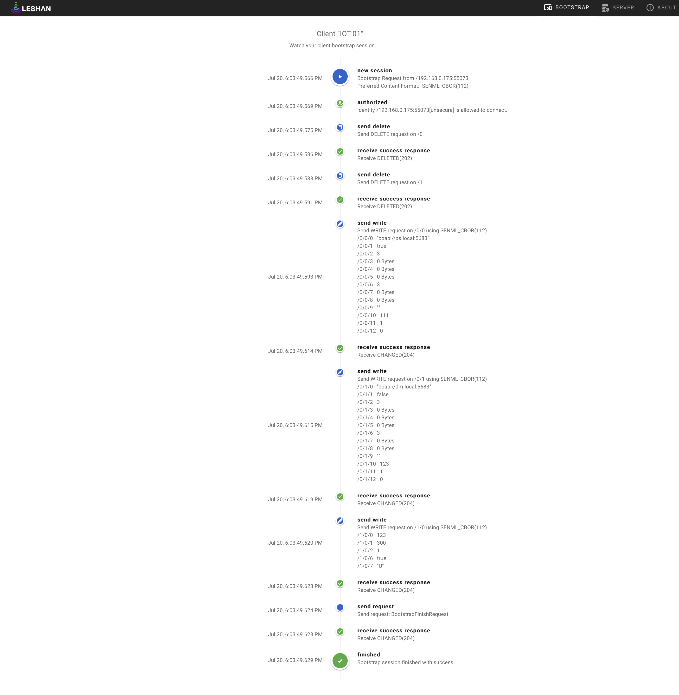
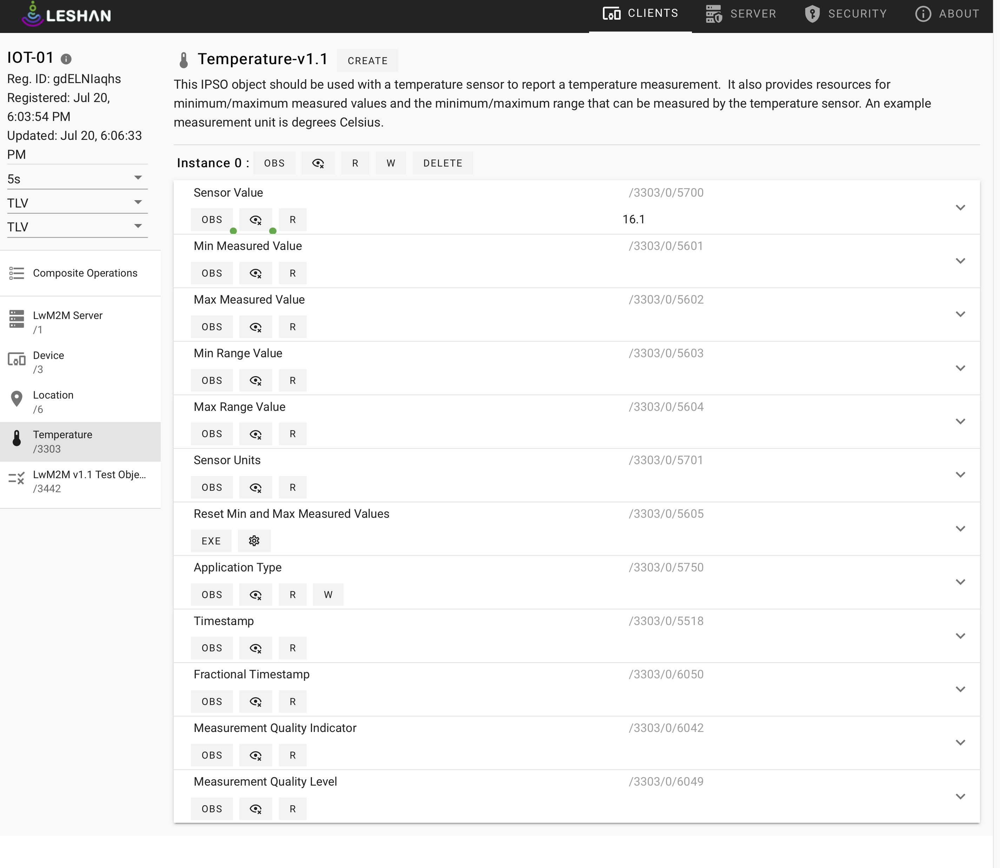

[Eclipse Leshan™](https://eclipse.org/leshan) is an OMA Lightweight M2M server and client Java implementation.

Clone the Leshan from the github via the formal release
- Create the DevEnv using IntelliJ IDEA
- Build the Leshan bootstrap, device management and client using the IntelliJ IDEA
- Configure bootstrap server application
```
   -lh
   bs.local
   -lp
   5683
   -slp
   5684
   -wh
   bs.local
   -wp
   8080
```
- Configure bootstrap web application
```
   $ cd leshan-leshan-2.0.0-M11/leshan-bsserver-demo/webapp
   $ yarn install
   $ yarn serve
```


- Configure device management server application
```
   -lh
   dm.local
   -lp
   5683
   -slp
   5684
   -wh
   dm.local
   -wp
   8080
```
- Configure bootstrap device management application
```
   $ cd leshan-leshan-2.0.0-M11/leshan-server-demo/webapp
   $ yarn install
   $ yarn serve
```

- Configure the IOT-01 device application
```
   -n
   IOT-01
   -lh
   iot01.local
   -b
   -u
   bs.local:5683
```
